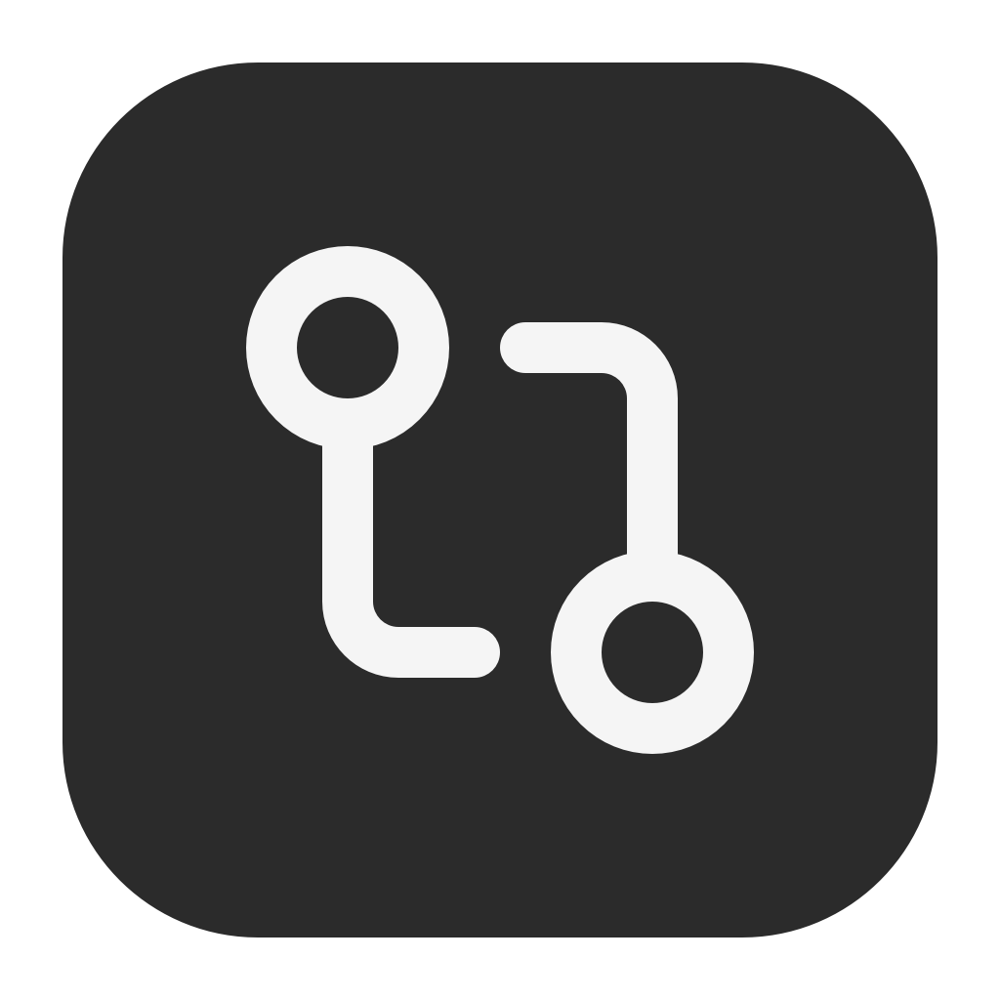
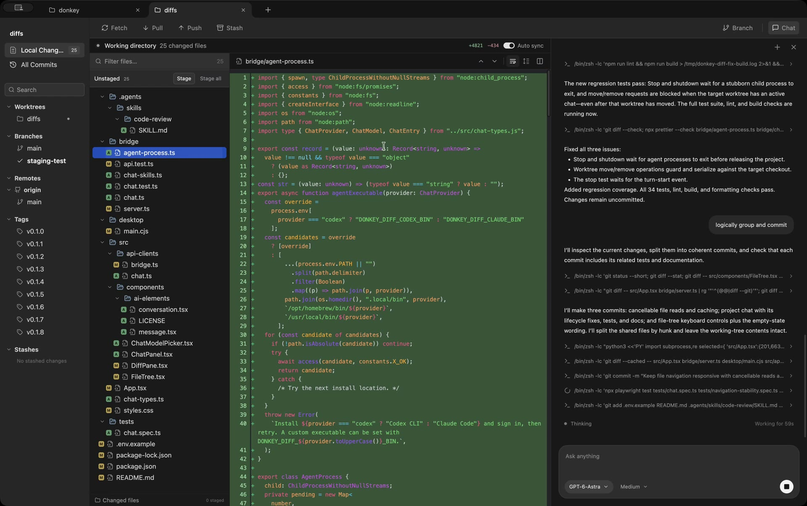

<p align="center">
  
</p>

# Donkey Diff

**Open source Git client for Mac.** Free to use, under the MIT license.

Review changes, manage branches and worktrees, and commit your work. Git operations run on your computer. A browser interface is also available.

**[Download for Mac](https://github.com/DonkeyCut/donkey-diff/releases/latest)** · [Website](https://donkeycut.github.io/donkey-diff/) · [Browser preview](https://diffs-workbench.vercel.app) · [MIT license](LICENSE)

[](https://donkeycut.github.io/donkey-diff/)

[Watch the demo](https://donkeycut.github.io/donkey-diff/demo.mp4)

## Features

### Diff viewer

Read unified or side-by-side diffs with syntax highlighting and line wrapping. Expand the full file for context, filter changed files, or browse the whole repository. Diff rendering is powered by [Pierre’s Diffs](https://diffs.com).

### Inline asset previews

See SVG assets rendered alongside their source. Compare before and after previews in a diff, or preview the current SVG while browsing files.

### Staging and commits

Double-click a file or folder to stage or unstage it. Review your staged changes, write a message, and commit. Everything else stays in your working directory. Stash tracked and untracked changes when you need to put unfinished work aside; apply, pop, or delete stashes later.

### Branches and worktrees

Keep projects in separate tabs. Create, switch, rename, and delete local branches. Create, open, move, and remove worktrees to keep another branch checked out in its own folder. Branch and worktree deletion use Git’s safety checks.

### Commit history

Browse the latest 150 commits, inspect commit details, and read historical file diffs. Select two commits to compare their snapshots. Use Shift-click or Cmd/Ctrl-click to select multiple commits.

### Codex and Claude

Ask an agent to explain code, make an edit, or review changes. Follow streaming replies, commands, and file activity beside your diff. Choose a model from your installed agents, run repository skills with slash commands, and keep conversations for each project.

Requires a signed-in Codex or Claude CLI. Chat uses that provider’s service and your existing account. See [project chat](#project-chat) for setup and behavior.

### More features

- **Fetch, pull, and push.** Use your existing Git credentials. Optional auto sync fetches regularly and pulls only when your working tree is clean and a fast-forward is possible.
- **Resolve conflicts.** Compare current and incoming versions side by side. Choose a version or edit the resolution, then save and stage the file.
- **Arrange your view.** Resize the sidebar, commit history, and file tree. Panel sizes are saved, and the layout adapts to smaller screens.
- **Work locally.** Git operations run on your computer. The Mac app includes the local service; the browser interface connects to it.

## Get started on Mac

1. Download the Apple Silicon Mac app from Releases and unzip it.
2. Open **Donkey Diff**.
3. Click **Add Project** and select a Git project.

The app starts its local service automatically and remembers your projects. No Node.js installation, terminal, pairing key, or browser permissions are needed. Git must be installed; push and pull use your existing Git credentials.

Local development packages are unsigned. The daily release workflow requires Developer ID signing and Apple notarization before publishing; its credentials and first successful run still need to be verified. See [release setup](RELEASES.md).

## Browser setup (advanced)

A hosted website cannot directly access your computer's Git repositories. The Vercel deployment serves only the interface; a small authenticated service on **127.0.0.1:43127** runs Git locally. Your source code is sent directly from that service to your browser, never through a Vercel API or cloud database.

Requirements: **Node.js 22.12+** and **Git**. Remote operations use your existing local Git credentials / SSH agent. Authentication prompts are disabled in the bridge; authenticate in your terminal first if needed.

```sh
git clone https://github.com/DonkeyCut/donkey-diff.git donkey-diff
cd donkey-diff
npm ci
npm run bridge -- /absolute/path/to/your/repository
```

Keep that terminal running, open **https://diffs-workbench.vercel.app**, and click **Connect → Pair with local bridge**. Allow local network access if your browser asks. The pairing key is stored only in this browser tab's session storage. Re-pair after starting a new browser session.

Add more projects with **File → Open Project…** and their absolute local paths. Closing a project tab does not delete its repository. You can also explicitly scan a projects directory at startup:

```sh
npm run bridge -- --root /absolute/path/to/projects
```

The scan registers immediate subdirectories containing Git repositories. Use it only for directories you intend to expose to your paired app.

If your browser blocks hosted-to-local requests, run the interface locally:

```sh
npm run dev
# Open http://127.0.0.1:5173 and pair there.
```

### Sync behavior

The active repository refreshes every 10 seconds while visible. With **Auto sync** enabled, it also fetches on project entry, browser focus, and every 60 seconds. It pulls only when the worktree is clean and an upstream exists, using `git pull --ff-only`. Divergence, authentication errors, or dirty files are reported inline or in the Auto sync status. Sync never force-pushes, resets, auto-stashes, or creates merge commits.

Remote commands use a 60-second timeout. Push uses `origin` and sets the current branch's upstream. Configure remotes in your terminal.

### Bridge configuration

| Variable                      | Default                              | Purpose                                               |
| ----------------------------- | ------------------------------------ | ----------------------------------------------------- |
| `DONKEY_DIFF_DATA_DIR`        | `~/.donkey-diff`                     | Private token and registered project paths            |
| `DONKEY_DIFF_ALLOWED_ORIGINS` | `https://diffs-workbench.vercel.app` | Comma-separated production origins                    |
| `DONKEY_DIFF_PORT`            | `43127`                              | Bridge port (the frontend currently uses the default) |

Local Vite origins on ports 5173 and 4173 are allowed for development. Pairing accepts only configured origins. The service binds to loopback, validates the Host header and Origin, authenticates API requests with a random bearer token, and serializes mutations per repository. Tokens and project paths are excluded from Git. Stop the bridge to revoke access; delete its token file while stopped to rotate the key.

Only pair with a deployment you trust: the paired interface can read and modify registered repositories, and add repositories accessible to your OS account. Git hooks and configured remote helpers run as part of normal Git operations. Do not register untrusted repositories.

## Development

```sh
npm ci
npm run bridge -- /absolute/path/to/repo
npm run dev
# Or run the desktop app:
npm run desktop
# Build the Apple Silicon Mac app:
npm run package:mac
npm run ts-check
npm run lint
npm test
npm run build
```

Stack: React 19, TypeScript, Vite, Tailwind CSS 4, shadcn-style components built with Radix primitives, Express, Zod, and `@pierre/diffs`.

### Mac updates

Packaged Mac builds use Sparkle 2 with a custom update button. Checks run in the background; the blue top-right **Update** button appears only when an update is available and remains visible during installation. Clicking it downloads, installs, and restarts the app. Development builds do not run the updater. Git operations must finish before installation can start.

`npm run package:mac` requires the Xcode command-line tools. It downloads the pinned, checksum-verified Sparkle framework and compiles the native Electron bridge. Update configuration lives in `desktop/sparkle/config.json`. Until a public signing key is configured, update checks are disabled and the button stays hidden.

For the initial signing setup, explicitly create a dedicated key with `.cache/sparkle/bin/generate_keys --account donkey-diff`, then put its public key in the config's `publicKey` field. Keep the private key in Keychain; do not commit or reuse another app's signing key. Build-time overrides are `DONKEY_DIFF_SPARKLE_PUBLIC_ED_KEY` and `DONKEY_DIFF_SPARKLE_FEED_URL`.

To prepare a release, increase the package version, run `npm run package:mac`, then `npm run prepare:update`. Sparkle signs the ZIP using the `donkey-diff` Keychain account and generates `appcast.xml`. For CI, `DONKEY_DIFF_SPARKLE_PRIVATE_KEY_FILE` can point to a securely provisioned private-key file. These commands do not publish anything. When ready to publish, upload the ZIP and generated `appcast.xml` to the matching `v<version>` GitHub release. The configured feed reads the appcast asset from the latest release. The shipped public key must match the signing key. The initial feed has no releases; automatic updates become available only after a signed release and feed are published. Distribution builds also need Apple signing and notarization; the current local packaging configuration is unsigned.

The [daily release workflow and required secrets](RELEASES.md) cover signed distribution builds. Basic native usage telemetry is configured through an ignored `.env.local` file during packaging and can be disabled from **Privacy → Send Anonymous Usage Statistics**. It sends no repository names, paths, code, or commit messages.

- `src/` — browser app, central API client, components, and styles
- `desktop/` — Electron app, native folder picker, and restricted IPC
- `bridge/` — local HTTP service and Git operations
- `bridge/*.test.ts` — real temporary-repository integration tests

## Project chat

Click **Chat** to the right of **Branch** to open a resizable project panel. Choose a GPT or Claude model from the composer’s model chip. The agent starts in the selected repository or worktree and can read code, edit files, and run Git and shell commands you request. It uses the CLI's existing sign-in and configured MCP tools; prompts and context are handled by that provider as in its CLI.

Install and sign into at least one local CLI first (`codex login` or `claude`). The bridge looks on `PATH`, in `~/.local/bin`, and in common Homebrew locations. Custom locations can be supplied with `DONKEY_DIFF_CODEX_BIN` and `DONKEY_DIFF_CLAUDE_BIN` in the bridge's environment. Executables are launched directly, without passing user messages through a shell.

Codex conversations use the [local app-server protocol](https://developers.openai.com/codex/app-server); current Codex no longer provides `mcp-server`. Claude conversations use its [streaming CLI interface](https://code.claude.com/docs/en/headless); `claude mcp serve` exposes tools, not a conversational agent. No separate API key or hosted chat server is required by Donkey Diff. Both model lists and supported effort levels are discovered from the installed local agents. Selecting a model also selects its provider.

The panel streams replies, shows Thinking and elapsed time, and exposes expandable command and file activity. **Stop** terminates that run and its child processes; it does not undo changes already made. Closing the panel leaves the run active. One conversation runs at a time per project, and other Git actions on that project are unavailable until it finishes. Auto sync pauses during the active chat. Conversations and provider session IDs are saved privately under the bridge data directory in `chats/`; the desktop app uses its own application data directory. The active conversation resumes after reload; use **+** to start a new chat. Browser drafts are saved separately per project.

### Repository slash commands

Add a folder containing `SKILL.md` under `.agents/skills/`. For example:

```text
.agents/skills/code-review/SKILL.md
```

```md
---
name: code-review
description: Review changes for bugs and regressions.
---

Review the requested changes. Report actionable findings with file paths,
line numbers, and concrete failure scenarios. Preserve the user's work.
```

Type `/code review` or `/code-review` and select the skill with Enter, Tab, or a click. Add optional instructions and send; the selected skill can also run by itself. The picker also appears after text in the composer. The backend reads the selected skill afresh before each invocation and includes its path so the agent can resolve supporting files. `.claude/skills/`, `.codex/skills/`, and `.donkey-diff/skills/` are also discovered, in that order after `.agents/skills/`. Duplicate names use the first location. Skills are limited to this repository, including symlink targets, and each `SKILL.md` must be at most 100 KB.

This repository includes a working `code-review` skill. Skill discovery refreshes while the panel is open. Frontmatter uses single-line `name` and `description` fields.

## Deployment

```sh
npx vercel --prod
```

Vercel hosts the static `dist/` directory. The bridge is **not** deployed as a serverless function. For a fork/custom domain, set `DONKEY_DIFF_ALLOWED_ORIGINS` to that deployment's exact origin when starting your bridge. The root page is a clearly labeled example until paired.

## Scope and limitations

- Text files up to 5 MB; binary files display a notice. Symlink file content is not followed.
- History is limited to the newest 150 commits. Git submodule contents are separate repositories.
- Conflict controls choose entire current/incoming versions or let you manually edit a resolution; finish the merge with a commit.
- Worktree and branch deletion use Git's safety checks (no force deletion).
- The Mac app includes the local service. Browser filesystem access requires the bridge on the same computer. A phone can view the responsive preview but cannot access another computer's loopback service.

## Contributing

See [CONTRIBUTING.md](CONTRIBUTING.md). Bug reports and improvements are welcome.

## License and credits

MIT © 2026 David Le. Diff rendering by [The Pierre Computer Company](https://diffs.com); icons by [Lucide](https://lucide.dev). Chat conversation and message primitives are adapted from [Vercel AI Elements](https://elements.ai-sdk.dev/) under Apache-2.0 (license in `src/components/ai-elements/LICENSE`), with streaming Markdown rendered by Streamdown. The project is independent of Pierre and Vercel.
